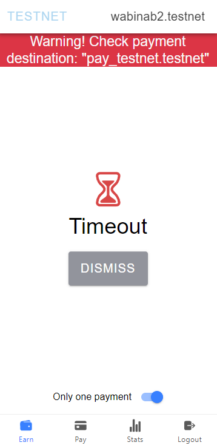

# Pay NEAR
This mobile app is designed to make payments in NEAR protocol by scanning a qrcode. What features it has except making it easy? 
- Any payments and earnings made with this app could be seen in statistics (basic) (requires to pay storage)
- It charges maximum 0.025N for every payment, or 0.1% if less than 25N. 
- Rather than just scan the code and type the value yourself (like most qrcode in wallet app), you'd have the receiver type the amount, the payer don't need to type the amount in. 
- And some other stuffs not of significance. 
- Supports MyNearWallet (web) and HERE wallet. Unfortunately, NEAR mobile wallet failed during testing, so one disabled it. HERE wallet requires an older version to work, as an update in january 2024 make signing smart contract to pop up with problems that one can't fix. Ultimately, only MyNearWallet works well. Other wallet like extension that aren't really mobile-based aren't supported. Though, if you found something new, do open an issue and one'll check whether to add it for support or not. 

NOTE: This is a failed entry. Reason? Somehow, it can't login on mobile. 

---
# How To Install
No installation required. Just visit `https://wabinab.github.io/pay-near` from your browser and it'll be available. It may prompt you to install the app, and you could choose to do so. However, note that this prompt doesn't always comes out, especially in situations where: 
- You have an older phone, hence an older browser app. 
- You have an older browser app. 
- You use untested app (like duckduckgo, tor, etc.) to browse that one isn't familiar of its workings. 

In these case, you either have to tolerate for using it only on browser, or find out how to get a newer version, esp. of the app. E.g. modern browser app, if you open up the hamburger menu (the thingy with three horizontal lines), it has "Add to Phone" or "Add to Home" functionality that saves a page to home, either browse like a local app, or acts as a shortcut. Either way, you don't have to type the url every time to visit it. Easy! 

Note: in newer phones, the installation isn't always success, esp. if you use a phone that has by default, **turn off-ed permission**, which is true for some phones from China, like my Redmi. In that case, the installation doesn't work. How'd one fixed that? 
- Well, one used its native browser app rather than Microsoft Edge to do the installation. Of course, the native app is a shortcut rather than local installation type, so one'll have to bear with it. 
- Another way is one keep it open as a tab inside my Edge app, so one can just click on that tab. 

If you're free to help me see why, the APK is available here: [https://github.com/Wabinab/pay-near/releases/tag/0.4.1](https://github.com/Wabinab/pay-near/releases/tag/0.4.1), the well-known file [here](https://wabinab.github.io/.well-known/assetlinks.json). It does works with the `adb shell am start` thingy tried on debug version (with a different SHA256 one suppose) with android studio; yet not on release version. I wonder why, oh, I wonder why...!!!

---
# How To Use
**Before you start, check that you're browsing the correct url: `https://wabinab.github.io/pay-near`.** If you can't read, use some online text compare tools like [text compare](https://text-compare.com/) to ensure they're the same. 

Next, login. The supported wallets are: 
- My Near Wallet (tested usable)
- Here Wallet (this has an error, see [here](https://github.com/here-wallet/js-sdk/issues/1))
- Near Mobile Wallet (Not working on older browsers. Please update your browser)
- Ledger (on desktop only, untested because one don't use a ledger, and don't have one either. Use at your own risk.)

**NOTE if you use APP WALLET** (Here and Near Mobile Wallet): **Please refresh the page manually!!!**, otherwise, you'd be confused why it is login but still asking you to login. 

(Other wallets aren't supported so one don't have to test them. E.g. mintbase wallet requires Windows Hello, if on Windows, and can't be used on phone, so one abandon it. Others are extension wallet, and requires more work to deal with on phone, so one thought no need, unless you could convince me otherwise. WalletConnect seems to be a free starting with limited quota until it needs payment later on if need more, so one set that and try it out, but removed it afterwards.)

Note, these tutorials are demonstrated with testnet; but it'll be the same on mainnet. 

### Earn / Receive Money

After login, you can set your payment amount in the middle. Here, we set to 12.5 N. The units is NEAR, yes. Then, you can click on the **lock** to display the QR code. 

The **unlock** button will get you back to the previous page. Note: **clicking the unlock button will vibrate the phone**. This ensures the payee doesn't do magic and secretly change the amount when you show him the QR code. 

See the "(right button) To display receipt when someone paid." text, and the button that looks like the receipt right of the lock/unlock? Usually, only the person who's performing the transaction (i.e. the payee) will receive some return value after he made the transaction, and you won't know about it. This is the button to make you know about it. 

**It charges 0.1N as storage fee to activate such button.**

(Note: if you're logged out for whatever reasons, just login again.)

You should see now the new page, with this button below: 

At the bottom, you can see "Only one payment". If you deactivate the button, it'll say "Accept multiple payments". What that means is, when you accept only a single payment, and the payee pay, it'll check for changes and redirect you to the receipt page upon completion. If you instead have multiple payees, then this redirection isn't supported. You'll have to manually unlock it afterwards and manually check with each payee whether they have made the transactions in your receiving wallet's transaction history. 

(Note: if you detect for payment, it'll have a timeout of 5 minutes. If nothing is paid within 5 minutes, it'll timeout. Example like image below:)

Here's an image showing what it looks like for a single payment, upon transaction succeeded. 

You can press "Dismiss" after you've read its content. Basically, you have an address on the left, sending to the address on the right. Next row: you have the amount send (1 N), and the amount received (0.999 N == 999 mN), with its charges (0.001 N == 1 mN). You paid 1N, refund 0N. (Note: this refund will never display value larger than 0 on this app, only if you deal with lower level stuffs like directly interacting with its smart contract will it have a difference. If it does display value larger than 0, please tell me how did you get there, it might be a bug!)

Minimum value per transaction is 0.001 N, maximum value is 50,000,000 N. 

As for the **warning! check payment destination** you should only have two: `pay_testnet.testnet`, and `pay_near.near`. Beware of phishings! Usually, you can check for more information just before you approve the transaction, look around for extra links that dropdown into extra information, or wallet app tends to show it in its information as well, where you can verify. 

### Pay / Send Money

### Logout/Sign Out
Logout just double press that button, and it should work for all except Near Mobile Wallet (because you need to go to Near Mobile Wallet app to give it permission to sign out, so double sign out). 